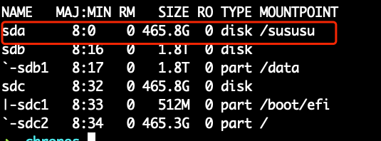
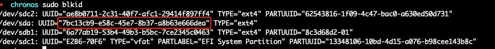

# install os
 - `centos7` or `ubuntu`
# mount local disks
> we need add extra disks for data persistence

- add new disk
  - 
- format disk
  - `mkfs.ext4 /dev/sda`
- get disk uuid
  - `sudo blkid`
  - 
- create mount point
  - `DISK_UUID=7bc13cb9-e58c-45e7-8b37-a8b63e666dea`
  - `mkdir -p /sususu`
  - `echo $DISK_UUID /sususu ext4 defaults 0 0 >> /etc/fstab`
  - `mount -a`
  - `df -h | grep sda`
    - 
- create mount --bind
  - `mkdir -p /sususu/disks/mysql/volume0`
  - `mkdir -p /sususu/locals/mysql/volume0`
  - `sudo mount --bind /sususu/disks/mysql/volume0 /sususu/locals/mysql/volume0`
  - `sudo echo /sususu/disks/mysql/volume0 /sususu/locals/mysql/volume0 none bind 0 0 >> /etc/fstab`
  - 

